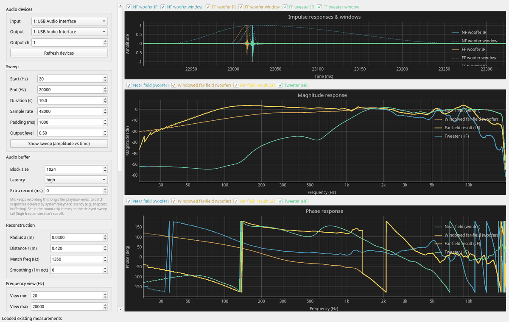
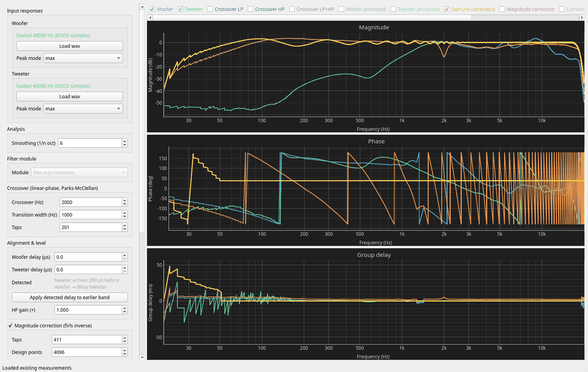
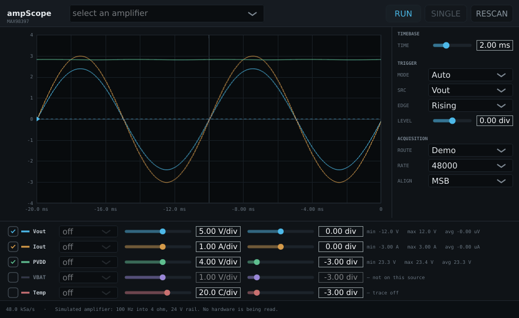
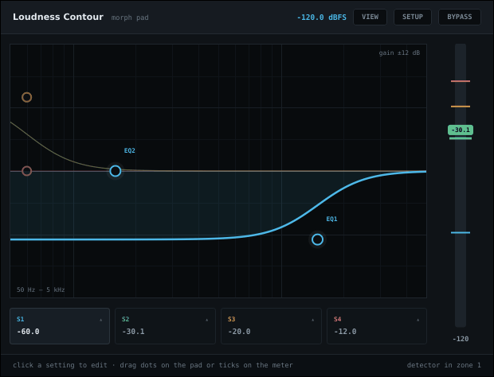

# bpi_amp_dsp_tuning

A set of simple audio DSP tools, consisting of loudspeaker measurement/tuning gui tools and audio plugins to complement the [BPI AMP PLATFORM](https://github.com/AMuszkat/bpi_amp_platform)

```
 python_dsp_tools/                                            juce_plugins/
 ┌────────────────────────┐   wav    ┌──────────────────────┐  .hpp   ┌─────────────────────┐
 │ measurement/           │ ───────► │ tuning/              │ ──────► │ crossover  (lp/hp)  │
 │ near-field + far-field │   IRs    │ crossover, delays,   │ headers │ firConv (correction)│
 │ capture, gating, splice│          │ correction filters   │         │ loudness, ampScope  │
 └────────────────────────┘          └──────────────────────┘         └─────────────────────┘
        shared DSP core: python_dsp_tools/nearfield/          built with juce_plugins/tools/
```

1. **Measure.** The measurement GUI plays a sine sweep and records the woofer close to the cone
   (near field), the woofer at a distance (far field) and the tweeter.(Implements the well-known near field measurement technique by Keele.) It gates each response
   in time and splices near and far field together. The result is an estimate of the anechoic
   response down to low frequencies, which a single in-room measurement can't give you.
   [How the method works](docs/near-field-method.md).
2. **Tune.** The tuning GUI loads the two driver responses and designs a linear-phase
   crossover, per-band delays and magnitude/group-delay correction, all live. It then exports
   the coefficients as C++ headers.
3. **Run.** The JUCE plugins compile those headers in. They are cross-compiled in a Podman
   container for Debian ARM64 and deployed over ssh.

## Screenshots

<table>
  <tr valign="top">
    <td width="50%"></td>
    <td width="50%"></td>
  </tr>
  <tr valign="top">
    <td><b>Measurement GUI:</b> gated impulse responses and the spliced near/far-field woofer and tweeter response.</td>
    <td><b>Tuning GUI:</b> driver responses, crossover sum and corrected output, with every filter parameter live.</td>
  </tr>
  <tr valign="top">
    <td></td>
    <td></td>
  </tr>
  <tr valign="top">
    <td><b>ampScope plugin:</b> oscilloscope for the amplifier's own voltage, current and supply telemetry.</td>
    <td><b>loudness plugin:</b> level-dependent loudness contour, two low-shelf EQs per setting.</td>
  </tr>
</table>

## Repository map

| Path | What it is |
|---|---|
| [`python_dsp_tools/`](python_dsp_tools/README.md) | Python tools: one conda env, a shared DSP package and two independent GUIs |
| ├─ [`measurement/`](python_dsp_tools/measurement/README.md) | Near-field measurement GUI |
| ├─ [`tuning/`](python_dsp_tools/tuning/README.md) | Filter-design (tuning) GUI; exports the plugin headers |
| ├─ `nearfield/` | Shared DSP core (`lib.py`) and the local-config loader |
| ├─ [`scripts/`](python_dsp_tools/scripts/README.md) | The original command-line scripts the GUIs grew out of |
| └─ `examples/` | A sample woofer/tweeter measurement to try the tuning GUI with |
| [`juce_plugins/`](juce_plugins/README.md) | JUCE/C++ LV2 plugins, their shared build system and the JUCE submodule |
| `docs/` | [The near-field method](docs/near-field-method.md), a JUCE [knowledge base](docs/juce-knowledge/) and the screenshots above (`images/`) |
| `config/` | `local.env.example`, the template for machine-specific settings |

## Quick start

```bash
git clone --recurse-submodules <this repo>        # or later: git submodule update --init
cp config/local.env.example config/local.env      # then fill in your devices / deploy host

# Python tools (conda/miniforge)
python_dsp_tools/setup_env.sh                     # one-time
python_dsp_tools/measurement/run.sh               # measure
python_dsp_tools/tuning/run.sh                    # design filters, "Export C++ headers"

# Plugins (Podman)
juce_plugins/tools/build-podman.sh all            # cross-compile every plugin for ARM64
juce_plugins/tools/build-podman.sh all -install   # deploy to DEPLOY_HOST
```

## Machine-specific settings

Audio device names, the data folder and the ssh address of the target board are all kept
out of the source. They go in `config/local.env`, which is gitignored; the tracked template
is [`config/local.env.example`](config/local.env.example). The Python tools and the build
scripts read the same file. An environment variable with the same name overrides it for a
single run.

## Requirements

- **Python tools:** Linux or macOS with [miniforge](https://github.com/conda-forge/miniforge),
  an audio interface and a measurement microphone.
- **Plugins:** [Podman](https://podman.io). The builds are tested on a Linux x86_64 host
  targeting Debian 12 (bookworm) on ARM64. The local debug loop (`-debug-linux`) needs a
  Linux desktop.

## License

Copyright (C) 2026 AMuszkat.

This whole repository (the Python tools and the JUCE plugins) is free software under the
**GNU Affero General Public License v3.0**; see [`LICENSE`](LICENSE). You may use, modify and
redistribute it under those terms. It comes with no warranty.

The plugins build on [JUCE](https://juce.com), which is itself available under AGPLv3, so the
two licenses match. The JUCE submodule keeps its own license (`juce_plugins/JUCE/LICENSE.md`).
